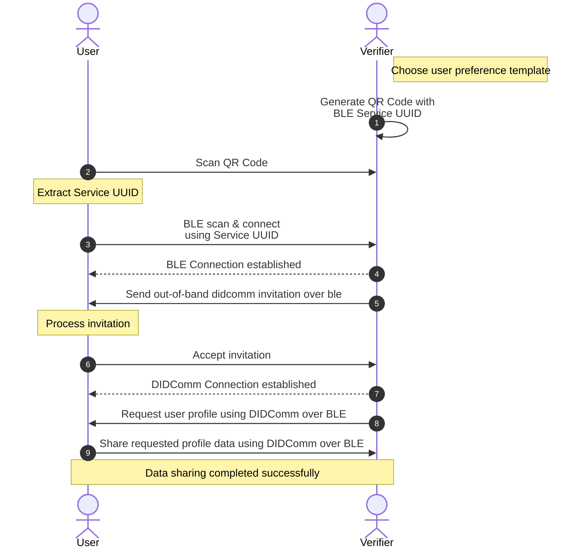

# User Profile App: DIF Hackathon 👋

This App helps in storing and sharing user profile data using DID Communication with Bluetooth as a transport layer.

## Table of Contents

1. [Links](#links)
2. [Instructions to Setup](#instructions-to-setup)
3. [Tech Stack](#tech-stack)
4. [Solution](#solution)

## Links

- [Documentation](https://docs.expo.dev/)
- [GitHub repository](https://github.com/expo/expo)
- [Expo on Stack Overflow](https://stackoverflow.com/questions/tagged/expo)
- [Expo on Twitter](https://twitter.com/expo)

## Instructions to Setup

> Note: You will need to have real `Android` device connected to your computer to run the app.

Follow these instructions to set up and run the project:

- Clone the Git repository: `https://github.com/sairanjit/user-profile-app`
- Install project dependencies: `pnpm install`
- Build the native dependencies: `pnpm prebuild`
- Run the app: `pnpm android`

## Tech Stack

### Frontend

- [React Native](https://reactnative.dev/)
- [Expo](https://expo.dev/)
- [React Navigation](https://reactnavigation.org/)
- [React Native Paper](https://callstack.github.io/react-native-paper/)

### Dependencies

- [Credo](https://github.com/openwallet-foundation/credo-ts)
- [Bluetooth](https://github.com/animo-id/react-native-ble-didcomm)

### DIF Work Items

- [DIDs](https://didcomm.org/)
- [DIDComm over Bluetooth](https://github.com/decentralized-identity/didcomm-bluetooth/tree/main)
- [Peer DID Method](https://github.com/decentralized-identity/peer-did-method-spec)
- [User Profile DIDComm Spec](https://didcomm.org/user-profile/1.0/)

## Solution

1. Initial Setup (Verifier Side):
   1. Verifier selects a user preference template
   2. Verifier generates a QR code containing a Bluetooth Low Energy (BLE) Service UUID
   3. Verifier start advertising using the above Service UUID
2. User Interaction with QR Code:
   1. User scans the QR code using their device
   2. User's device extracts the BLE Service UUID from the QR code
3. BLE Connection Establishment:
   1. User's device initiates a BLE scan using the extracted Service UUID
   2. User's device connects to the Verifier using the Service UUID
   3. BLE connection is successfully established between User and Verifier
4. DIDComm Setup:
   1. Verifier sends a DIDComm invitation to User over the BLE connection
   2. User processes the received DIDComm invitation
   3. User accepts the DIDComm invitation
   4. DIDComm connection is successfully established over BLE
5. User Profile Data Exchange:
   1. Verifier sends a request for user profile data using DIDComm over BLE with the selected user preference template
   2. User shares the requested profile data using DIDComm over BLE
   3. Data sharing process completes successfully
6. BLE Connection Closure:
   1. User's device closes the BLE connection
   2. Verifier's device closes the BLE connection

