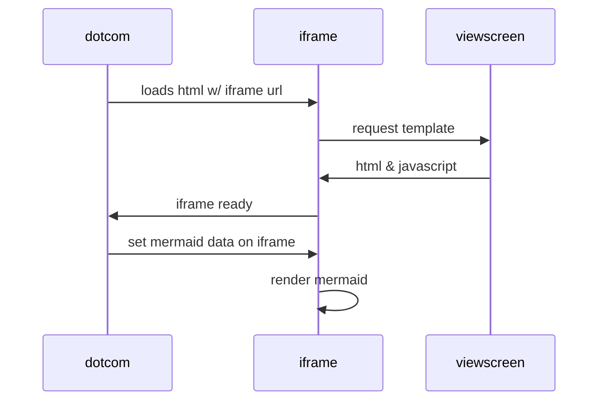

# User Profile App: DIF Hackathon 👋

This App helps in storing and sharing user profile data using DID Communication with Bluetooth as a transport layer.

## Table of Contents

1. [Links](#links)
2. [Instructions to Setup](#instructions-to-setup)
3. [Tech Stack](#tech-stack)
4. [Solution](#solution)

## Links

- [Documentation](https://docs.expo.dev/)
- [GitHub repository](https://github.com/expo/expo)
- [Expo on Stack Overflow](https://stackoverflow.com/questions/tagged/expo)
- [Expo on Twitter](https://twitter.com/expo)

## Instructions to Setup

> Note: You will need to have real `Android` device connected to your computer to run the app.

Follow these instructions to set up and run the project:

- Clone the Git repository: `https://github.com/sairanjit/user-profile-app`
- Install project dependencies: `pnpm install`
- Build the native dependencies: `pnpm prebuild`
- Run the app: `pnpm android`

## Tech Stack

### Frontend

- [React Native](https://reactnative.dev/)
- [Expo](https://expo.dev/)
- [React Navigation](https://reactnavigation.org/)
- [React Native Paper](https://callstack.github.io/react-native-paper/)

### Dependencies

- [Credo](https://github.com/openwallet-foundation/credo-ts)
- [Bluetooth](https://github.com/animo-id/react-native-ble-didcomm)

### DIF Work Items

- [DIDs](https://didcomm.org/)
- [DIDComm over Bluetooth](https://github.com/decentralized-identity/didcomm-bluetooth/tree/main)
- [Peer DID Method](https://github.com/decentralized-identity/peer-did-method-spec)

## Solution

